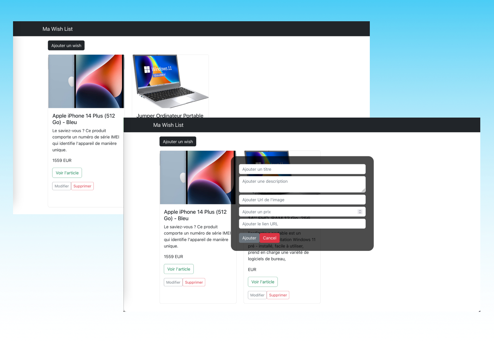

<!-- PROJECT LOGO -->
 

  

  <h3 align="center">Application Wishlist</h3>

  

    Application de gerer une liste d'achat, d'articles vues sur internet tout en conservant le lien de cet article. 
    L'application a été réaliser sous MERN Stack (MongoDB, React, NODE JS, & EXPRESS)
     
     
     
  

<!-- ABOUT THE PROJECT -->
## Preview of The Project

# Getting Started BackEnd 
